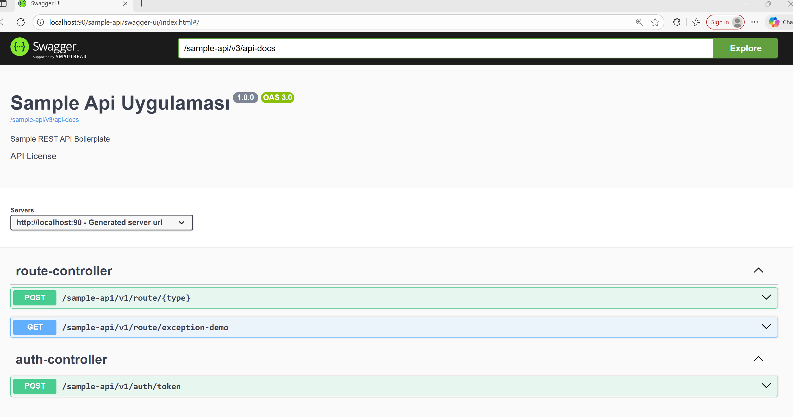

# Spring Boot REST API Boilerplate

## Proje Açıklaması
Bu proje, gerçek dünya örnekleriyle "konsept → uygulama" köprüsünü kurmak için hazırlanmış, Spring Boot tabanlı bir REST API boilerplate'idir. Özellikle üç önemli yazılım tasarım ve uygulama sorusuna odaklanır ve hem kavramsal açıklamaları hem de pratik bir uygulamayı beraber sunar:

1) Spring AOP Nedir? Nasıl İmplemente Edilir?
  - Projede AOP'nin ne olduğu, hangi problemleri çözdüğü ve Spring AOP ile nasıl uygulandığı gösterilmektedir. Gerçek uygulama örnekleri `tr/com/common/core/aop` içinde yer alan `LoggingAspect` sınıfında bulunabilir.

2) Yazılım projelerinde developer'lara kod yazdırmadan "loglama" ve "validation" ihtiyaçlarını nasıl çözersin?
  - Merkezi loglama (request/response/exception) ve cross-cutting validation yaklaşımları AOP ile nasıl otomatikleştirileceği gösterilmektedir. Otomatik loglama için `tr/com/common/core/aop/LoggingAspect.java`, özel validasyon örnekleri için `tr/com/common/core/validation` (ör. `TCKimlikNoValidator`) klasörlerine bakabilirsiniz. Bu sayede geliştiriciler controller veya service içine tekrarlayan log/validation kodları yazmak zorunda kalmazlar.

3) Bir harita uygulamasında 3 tür rota seçeneği var. Bunları Strategy design pattern ile nasıl yaparsın?
  - Rota hesaplama mantığı `sample/api/v1/routing` içinde strateji deseni (Strategy Pattern) ile uygulanmıştır. `Shortest`, `Fastest` ve `LeastTraffic` gibi ayrı stratejiler kolayca eklenip değiştirilebilir; bu yapı `strategy` paketinde açıkça örneklenmiştir.

Bu repository sadece bir konsept göstergesi değil; aynı zamanda üretime uygun mimari öğelerin (DTO/Record, global exception handling, JWT auth, bean validation ve Spring AOP ile merkezi cross-cutting-concerns çözümleri) nasıl entegre edildiğini somut bir şekilde sunar. Kodun ilgili kısımlarını inceleyerek yukarıdaki soruların hem teorik hem de uygulamalı cevaplarını bulabilirsiniz.

## Kullanılan Teknolojiler
- Java 25
- Spring Boot 4.0.0
- Spring AOP(Proxy based-JDK Dynamic Proxy Aspect Oriented Programming)
- Spring Security (JWT tabanlı kimlik doğrulama)
- Spring profile destekli yapılandırma
- Springdoc OpenAPI 2.7.0 (Swagger UI)
- Maven

## Kurulum ve Çalıştırma
1. **Projeyi klonlayın:**
   ```sh
   git clone https://github.com/ariferol/springboot-api.git
   
   mvn clean install
   ```
3. **Uygulamayı başlatın:**
   ```sh
   mvn spring-boot:run
   # veya
   java -jar target/sample-api-1.0.0.jar
   ```
4. **Varsayılan port:** `http://localhost:90`

## Proje Yapısı
Aşağıda projenin temel klasör ve dosya yapısı ile kısa açıklamaları bulunmaktadır. Geliştirirken önemli entry-point'ler ve ortak modüller buradan takip edilebilir.

```
docker-compose.yml
Dockerfile
pom.xml                       # Maven projesi ve bağımlılıklar
README.md
src/
  main/
    java/
      tr/com/common/core/     # Paylaşılan çekirdek (AOP, base sınıflar, util, validation)
        aop/                  # Örn: `LoggingAspect.java` (merkezi loglama)
        base/                 # BaseEntity, BaseRepository, DTO/RestController arayüzleri
        util/                 # ConverterUtil, JwtUtilBean, ExceptionUtilBean
        validation/           # Özel validator'lar (ör. TCKimlikNo)
      tr/com/sample/api/v1/    # Uygulamaya özel kod
        common/               # Config, security, routing, util
        routing/              # Rota hesaplama stratejileri (Strategy pattern)
    resources/
      application.yml         # Uygulama konfigürasyonları (örn. springdoc.swagger-ui.path)
  test/
target/                      # Derleme çıktıları

```

- **`tr.com.common.core.aop`**: Uygulama çapraz-kesit endişeleri için AOP tanımları (request/response/exception loglama).
- **`tr.com.sample.api.v1.routing`**: Rota hesaplama ve örnek iş mantığı (Shortest/Fastest/LeastTraffic).
- **`src/main/resources/application.yml`**: `springdoc` ve `api.base-path` gibi çalışma zamanı ayarları burada tanımlıdır.
- **`pom.xml`**: Spring Boot starter'ları ve proje bağımlılıkları; `springdoc-openapi-starter-webmvc-ui` swagger UI sağlar.

Bu yapı, geliştirme sırasında ortak bileşenlerin (`core`) yeniden kullanılmasını ve uygulama çapında tutarlı altyapı (security, validation, logging) sağlanmasını hedefler.

## Örnek API Kullanımı
### Route Servisi (Rota Hesaplama)
```sh
curl --location 'http://localhost:90/sample-api/v1/route/SHORTEST' \
--header 'Content-Type: application/json' \
--header 'Cookie: sampleapi=<JWT_TOKEN>' \
--data '{
    "startLat": 41.015137,
    "startLon": 28.979530,
    "endLat": 39.920770,
    "endLon": 32.854110,
    "tcKimlikNo": "50957599706"
}'
```
Yanıt örneği:
```json
{
  "data": {
    "description": "En kısa rota algoritması",
    "distanceKm": 349.58,
    "estimatedMinutes": 524.37
  },
  "description": "Rota başarıyla hesaplandı",
  "errorCode": 0,
  "responseTime": "29.11.2025 01:05:25",
  "statusCode": 200
}
```

### Kimlik Doğrulama (Login)
```sh
curl --location 'http://localhost:90/sample-api/v1/auth/token' \
--header 'Content-Type: application/json' \
--data '{
    "username": "50957599706",
    "password": "sifre123"
}'
```
Yanıt örneği:
```json
{
  "data": {
    "id": 1,
    "tcKimlikNo": "50957599706",
    "email": "test@example.com",
    "firstName": "Ali",
    "lastName": "Veli",
    "gender": "MALE",
    "groups": ["USER"],
    "roles": ["ROLE_USER"],
    "token": "<JWT_TOKEN>"
  },
  "description": "Login islemi basarili",
  "errorCode": 0,
  "responseTime": "29.11.2025 01:07:00",
  "statusCode": 200
}
```

## Mimaride Öne Çıkanlar
- **Katmanlı yapı:** Controller, Service, DTO, Entity, Strategy, Exception, Validation, Util, AOP
- Spring Boot tabanlı REST API altyapısı
- Temel kullanıcı doğrulama ve JWT desteği
- **Spring Stereo Type Katmanlı mimarisi** (Controller, Service, Repository). Eğitim amaçlı olduğu için **DDD ve Clean Architecture uygulanmamıştır**.
- Kolayca genişletilebilir ortak çekirdek bileşenler (`core/base`, `core/util`, `security/model`, `exception` vb.)
- **AOP ile merkezi loglama:** Developerların kod yazmadan tüm controller ve service method request/response larının ve exception loglarını console da görebilmeleri sağlanmıştır. Tüm Spring AOP çözümü, "tr.com.common" paketi içinde, harici jar olarak dışarıdan dependency olarak ayırılarak kullanılabilir durumdadır.
- **Bean Validation:** DTO/record parametrelerinde otomatik validasyon (Spring AOP ile @TCKimlikNo doğrulamasını, developerların kod yazmadan yapabilmeleri sağlanmıştır)
- **DTO/Record kullanımı:** Immutable veri transferi ve otomatik validasyon desteği
- **Strateji Pattern:** Rota hesaplama algoritmaları (Shortest, Fastest, LeastTraffic) için esnek ve genişletilebilir yapı
- **Global Exception Handler:** Hatalar standart response formatında döner

## Geliştirici Notları
- Tüm response'lar `ResponseDTO` ile standart formatta döner.
- Loglar Türkçe ve okunabilir şekilde Spring AOP ile developerlar hiç kod yazmadan otomatik basılır. Request/response loglama ve exception loglama yapıldı. Şu an controller ve servis methodları loglanmaktadır. Ancak Developerların belirli bir custom annotation ile de loglama yapılabilmeleri sağlanabilir(Bir methodun başına @Logla isminde bir annotation eklenerek sadece o methodun loglanmasının sağlanması gibi). LoggingAspect de servisler için CorrelationId de üretilebilir...
- Spring AOP ile validation çözümü de bulunmaktadır. Örnek olarak T.C Kimlik Numarası doğrulaması eklenmiştir.
- JWT tabanlı kimlik doğrulama örneği içerir.
- Spring AOP JDK Dynamic Proxy olarak sadece public methodları kesmek için kullanıldı.Protected ve default methodlar için CGLIB proxy kullanabilirsiniz. Private methodlar için; Compile-Time yada Load-Time Weaving, gerçek AspectJ bağımlılığını kullanmanız gerekir.
- Swagger/OpenAPI entegrasyonu prod ortamında kapatılmıştır. Sadece `dev` profili aktifken Swagger UI ve endpointleri çalışır.

## Katkı ve Geliştirme
- PR ve issue açarak katkıda bulunabilirsiniz.
- Kodda açıklamalar ve örnekler bolca yer almaktadır.

## Swagger / OpenAPI

> **Not:** Swagger/OpenAPI arayüzü ve endpointleri sadece `dev` profili aktifken çalışır. `prod` profilinde Swagger tamamen kapalıdır ve hiçbir endpoint erişilemez. Ortam bazlı ayrım için `GeneralConfigurer` sınıfında `@Profile("dev")` anotasyonu ve `application-prod.yml` dosyasında `springdoc.api-docs.enabled: false` ile `springdoc.swagger-ui.enabled: false` ayarları kullanılmıştır.

Proje `springdoc` ile otomatik OpenAPI (Swagger) dokümantasyonu sunar. Uygulamayı çalıştırdıktan sonra Swagger UI'a aşağıdaki adresten erişebilirsiniz:

- **URL:** `http://localhost:90/sample-api/swagger-ui/index.html`
- **API spec (raw):** `http://localhost:90/sample-api/v3/api-docs`

Kullanım:
- Uygulamayı başlatın:
  ```powershell
  cd c:\springboot-api
  mvn -DskipTests package
  mvn spring-boot:run
  ```
- Swagger UI üzerinden endpoint'leri görüntüleyip "Try it out" ile test edebilirsiniz.

Kimlik doğrulama (endpoint'ler yetkilendirme gerektiriyorsa):
- JWT token uygulamada cookie olarak `sampleapi` adıyla saklanır. Tarayıcıda cookie olarak ekleyebilirsiniz: `sampleapi=<JWT_TOKEN>`.
- Alternatif olarak `Authorization: Bearer <JWT_TOKEN>` header'ını kullanabilirsiniz (Swagger UI'de Authorize desteği varsa buradan ekleyin).

---

Her türlü soru ve katkınız için iletişime geçebilirsiniz.

## Lisans
Bu proje MIT Lisansı ile lisanslanmıştır — ayrıntılar için [LICENSE](LICENSE) dosyasına bakınız.


